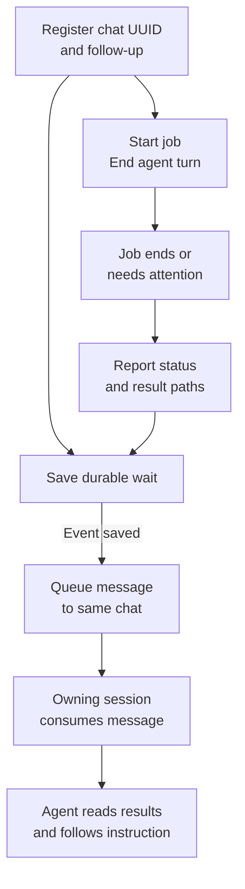

# Wake Codex

### Let the job finish. Then wake the agent.

**Event-driven continuations for Codex. No model polling while you wait.**

Training a model? Running a long build? Waiting for an evaluation? Wake Codex
keeps a durable record of the job and queues a follow-up in your existing Codex
chat when there is something to do.

No recurring "is it done yet?" prompts. No new chat for every update. No need to
leave an agent burning tokens to watch a process.

## Install Wake Codex with a Codex chat

**Paste this into a Codex chat to install Wake Codex and start using it:**

```text
Install Wake Codex for me from https://github.com/rotcev/wake-codex
so I can use it to resume Codex chats when long-running jobs finish.

Read its README and SKILL.md, inspect the code, and install it as a Codex skill
in my configured skills directory. Reuse an existing checkout if appropriate;
preserve any existing installation or local edits rather than overwriting them.

Check Python 3.10+ and that my authenticated Codex CLI supports `codex queue`.
Use a CLI matching my desktop installation if necessary. Don't change my model,
permissions, or app settings, and don't use `exec resume` for this desktop chat.

Run the token-free tests. Start the queue-backed listener with a private state
directory, then verify its health. Resolve this chat's actual UUID; never guess
it or create another chat as a substitute. If a prerequisite is missing, explain
the blocker instead of claiming setup succeeded.

I authorize one harmless end-to-end test in this chat: register a wait, launch
a short dummy job through Wake Codex, and have its completion queue an instruction
to reply once with “Wake Codex is connected.” The test must not touch my real jobs.
Tell me what is armed, then immediately end your turn so the queue can run.
Do not poll with a model, create a recurring automation, or retry the test blindly.

Keep tokens, state and logs private. Report the install path, state path, and
how to stop the listener. Distinguish message acceptance from an actual automatic
reply; don't claim the live test passed before that reply is observed.
```

Keep the host and owning Codex app/session available. **Let the setup turn end;
don't manually send the queued test.** The automatic reply is the useful check.
If you're using a different agent to install it, specify the target Codex chat
explicitly—the installer agent's conversation is not necessarily a Codex thread.

Prefer doing it yourself? Jump to the [command-line quick start](#quick-start).

Installation is reusable. The test uses the setup chat; for each real job, register
the Codex chat you want to receive its result and what the agent should do next.

## How the handoff works



**The job doesn't need to know your chat ID or how Codex works.** Wake Codex stores
that mapping. A wrapper can detect a foreground job's exit without changing its
code; an external producer only needs its private callback registration and a
small terminal event. Save result files before reporting completion.

While the job runs, only ordinary Python code waits—no model inference. The
follow-up uses a normal model turn once Codex consumes the message.

## Examples: what should happen when the job ends?

The saved instruction decides the follow-up. Start with inspection and reporting;
additional actions still need your authorization.

| Long-running job | Event | Example follow-up instruction |
| --- | --- | --- |
| Build or test suite | `completed` or `failed` | “Read the log. Summarize the result and the first actionable failure. Don't edit code yet.” |
| Dataset import | `completed` | “Check the output manifest and row counts. Report missing or rejected records.” |
| Model evaluation | `needs_review` | “Compare the saved metrics with the baseline. Recommend a next step; don't launch another run.” |
| Batch rendering or export | `completed` | “Inspect the output manifest and list the generated files.” |
| Job paused by a guardrail | `paused` | “Explain the recorded reason and what needs a decision. Don't resume the job.” |

For example, a test runner exits with a nonzero code → the wrapper saves a failure
event and log path → Wake Codex queues “inspect the log” → the agent reports the
failure in the same conversation. Nobody needs to repeatedly ask whether it's done.

## Why a queue, not another agent process?

A desktop chat can retain its writer lock even after its current turn ends.
Launching `codex exec resume` against that chat may fail with **"already has an
active writer."**

Wake Codex defaults to **`codex queue`**, which hands the message to the existing
session owner instead of competing for that lock. The native queue → automatic
follow-up → visible reply path was exercised in a live desktop chat, with its
queue also visible on the paired phone.

**Queue acceptance is not task completion.** Wake Codex records these separately.
See [verification and limitations](docs/verification.md) for precisely what was
tested and what still depends on your Codex installation.

## What you get

- **Zero model calls while waiting.** A lightweight Python listener handles events.
- **Your existing chat.** Delivery targets an explicit thread UUID.
- **Durable handoff.** SQLite preserves pending events across listener restarts.
- **Duplicate suppression.** The first terminal event wins; repeated callbacks
  do not enqueue another continuation.
- **Useful terminal states.** `completed`, `failed`, `paused`, `needs_review`, and
  `cancelled`.
- **Conservative recovery.** An uncertain delivery is flagged for inspection,
  never blindly retried.
- **Authenticated local callbacks.** The listener binds to `127.0.0.1`; each wait
  has a private callback token.
- **No Python dependencies.** Standard library only. Python 3.10+, Windows, macOS or Linux.
- **A Codex skill.** Included [SKILL.md](SKILL.md) explains when and how to use it.

## Requirements

1. Python 3.10 or newer on Windows, macOS or Linux.
2. An authenticated Codex CLI with **`codex queue --help`** support. The live
   desktop test used CLI **0.159.2**. This is a tested version, not a claim that
   every earlier or later release supports the same behavior.
3. An existing saved chat and its exact UUID. Keep the owning desktop/CLI session
   running for automatic consumption. Test your setup once before relying on it.

If the CLI on your PATH lacks `queue`, pass `--codex /absolute/path/to/codex`.
Prefer the binary matching your desktop installation. Wake Codex will fail the
capability check rather than silently falling back to the writer-conflicting path.

## Quick start

```sh
git clone https://github.com/rotcev/wake-codex.git
cd wake-codex

# One private state directory; use the same path for every command.
umask 077
WAKE_STATE="$PWD/.state"

python3 scripts/wakecodex.py --state "$WAKE_STATE" start
python3 scripts/wakecodex.py --state "$WAKE_STATE" doctor
```

`doctor` should report `healthy: true`, `backend: "queue"`, and `dry_run: false`.
The OS selects a free localhost port. No model is invoked by these checks.

### Windows (PowerShell)

Use the native `codex.exe` matching your desktop installation and a dedicated
state directory on a local filesystem that supports Windows ACLs (such as NTFS).
WSL and administrator access are not required. Use the actual executable rather
than an npm `codex.cmd` shim.

```powershell
$wakePython = (Get-Command python.exe).Source
$wakeCodex = (Get-Command codex.exe).Source
$wakeState = Join-Path $env:LOCALAPPDATA 'WakeCodex/state'
& $wakePython scripts/wakecodex.py --state $wakeState start --codex $wakeCodex
& $wakePython scripts/wakecodex.py --state $wakeState doctor
```

If Python or Codex is not on PATH, set its variable to the actual absolute
executable path. State creation restricts the directory ACL to the current user
before writing secrets. New files inherit that ACL. Always use a dedicated state
directory, not a shared or project directory. Background processes do not open
console windows.

Submit an authorized job using the exact saved chat UUID:

```powershell
& $wakePython scripts/wakecodex.py --state $wakeState submit `
  --thread YOUR_THREAD_UUID --cwd (Get-Location).Path `
  --then 'Read the result. Report once, then stop.' `
  -- $wakePython -c 'import time; time.sleep(10)'

# Stop this listener; jobs and already queued messages are unaffected.
& $wakePython scripts/wakecodex.py --state $wakeState stop
```

Registration output contains a callback secret. Keep it private. End the
submitting turn to allow the queued follow-up, and keep the host awake and the
owning Codex session available.

### Find the exact thread UUID

For a Codex app chat, use its host-provided thread identity or copy its chat link
and take the UUID from `codex://threads/UUID`. Confirm that the link identifies
the intended chat; a title, project ID, or installer conversation ID is not enough.
If your client exposes neither identity nor a chat link, stop and resolve the
identity in that client before submitting. Never guess or use `--last`.

For a CLI-owned chat, the JSON output from its original `codex exec --json` turn
contains `thread.started.thread_id`. Retain that exact value and wait for the
seed turn to complete. Do not create a replacement chat for an existing target.
Keep the owning host awake and session available, and end the submitting turn.

Callbacks wake the listener immediately. Its ordinary Python database
reconciliation runs every 30 seconds to recover missed nudges; **zero model
polling** means no model calls while waiting, not zero background service checks.

### Wrap a foreground job

Replace `YOUR_THREAD_UUID` with the UUID of the chat you want to continue:

```sh
python3 scripts/wakecodex.py --state "$WAKE_STATE" submit \
  --thread YOUR_THREAD_UUID \
  --cwd "$PWD" \
  --then 'Read the job result. Report success or failure briefly, then stop. Do not restart anything.' \
  -- python3 -c 'import time; time.sleep(10); print("Job finished")'
```

The command returns immediately with a wait ID. The detached wrapper captures
the job's exit status and log path, then emits an event. **End the submitting
agent turn** so Codex can consume the queued follow-up. The sleep is only a demo;
replace it with your actual foreground job.

The job command runs with the launcher's host permissions, not inside a Codex
model sandbox. Only submit commands you have authorized. A command that merely
launches another background job needs an explicit completion callback instead.

### Receive an external completion event

Register without a command and keep the returned JSON private:

```sh
python3 scripts/wakecodex.py --state "$WAKE_STATE" submit \
  --thread YOUR_THREAD_UUID --cwd "$PWD" \
  --then 'Inspect the saved evaluation artifacts and report the result. Do not start another run.' \
  > registration.json
```

Have the producer save a small terminal event **after** its outputs are safely
written. For example, `result.json` can contain:

```json
{
  "status": "needs_review",
  "message": "Evaluation finished; the next stage needs review.",
  "report_path": "/absolute/path/to/report.json"
}
```

Then send it:

```sh
python3 scripts/send_event.py \
  --registration registration.json --result result.json
```

Callback retries are safe because the same wait accepts only its first terminal
event. This is not a promise of exactly-once execution across crashes. See
[operations](docs/operations.md) for HTTP, existing-job watching, and recovery.

## Status means what it says

| Status | Meaning |
| --- | --- |
| `waiting` | Registered; no terminal event yet. |
| `ready` | Event saved durably; delivery pending. |
| `delivering` | A delivery attempt is in flight. |
| `queued` | Native queue acknowledged the target and message ID. Not proof the agent ran. |
| `delivered` | Legacy resume backend observed a completed turn. Not proof the task succeeded. |
| `needs_attention` | Delivery failed or is ambiguous. Inspect before retrying. |
| `previewed` | Dry-run prompt saved; nothing sent to Codex. |
| `cancelled` | A pending Wake Codex wait was cancelled locally. |

```sh
python3 scripts/wakecodex.py --state "$WAKE_STATE" list
python3 scripts/wakecodex.py --state "$WAKE_STATE" show WAIT_UUID
python3 scripts/wakecodex.py --state "$WAKE_STATE" cancel WAIT_UUID
python3 scripts/wakecodex.py --state "$WAKE_STATE" stop
```

Cancelling a wait does **not** kill training, retract an already queued message,
or interrupt an agent. Stopping the listener leaves jobs and saved events intact.

## Use it as a Codex skill

The repository root is a self-contained skill. From the cloned repository:

```sh
mkdir -p "$HOME/.codex/skills"
ln -s "$PWD" "$HOME/.codex/skills/wakecodex"
```

On Windows, copy the skill files instead of creating a Unix symlink. For a new
destination only:

```powershell
$wakeSkills = if ($env:CODEX_HOME) { Join-Path $env:CODEX_HOME 'skills' } else {
  Join-Path $env:USERPROFILE '.codex/skills'
}
$wakeSkill = Join-Path $wakeSkills 'wakecodex'
if (Test-Path -LiteralPath $wakeSkill) { throw 'Preserve the existing skill first.' }
New-Item -ItemType Directory -Path $wakeSkill -Force | Out-Null
Copy-Item README.md, SKILL.md, LICENSE, scripts, docs -Destination $wakeSkill -Recurse
```

If `wakecodex` already exists, inspect and back it up before replacing it—do not
blindly overwrite a customized installation. Reload skill discovery as needed.
Then ask Codex to use **Wake Codex** for an authorized long-running job.

## Test it without spending model tokens

```sh
python3 -m unittest discover -s tests -v
```

The suite includes a real localhost HTTP listener and a real subprocess acting
as a fake Codex queue. It tests authentication, persistence, duplicate callbacks,
crash-safe delivery decisions, terminal-event handling, and queue acknowledgments.
These are deterministic plumbing tests, not a substitute for one live test in
your app version.

## Security and scope

- Queue delivery inherits the existing chat's model, tools, and permissions. It
  does **not** impose a new read-only sandbox. Keep continuation instructions narrow.
- Callback payloads are untrusted result data, not authority to perform new work.
- State, callback credentials, prompts and logs stay local. Do not commit them.
- Event payloads are limited to 64 KiB. Send artifact paths, not giant logs.
- No desktop lock bypasses, private IPC injection, recurring agent polling, or
  automatic retries of uncertain model actions.
- The host must stay awake. Reboot recovery of in-flight job processes is not
  implemented; durable events survive, but a running job is not magically restored.

**Independent community project. Not affiliated with or endorsed by OpenAI.**

MIT licensed. Built for the moments when the useful thing for an agent to do is
*wait without thinking—and return when there is evidence to act on.*
